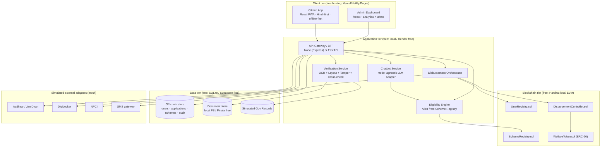
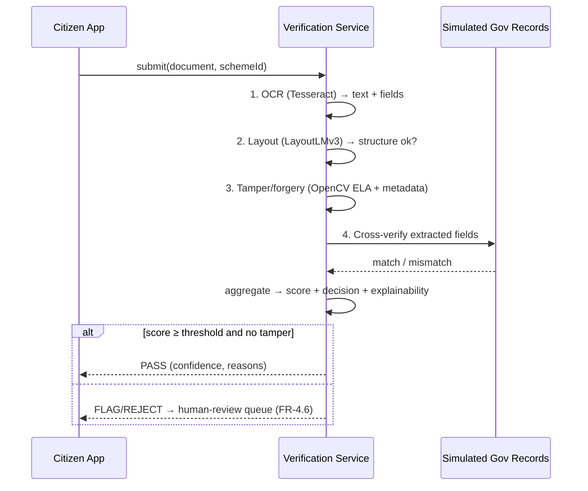
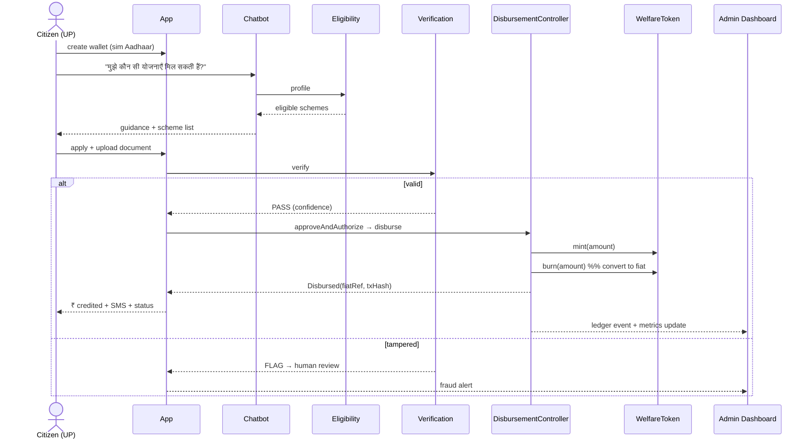

# WelfareChain — System Design Document (SDD)
### Phase 2–3: Design & Development
*Companion to the Engineering Foundation Document (Feasibility + SRS). This document turns every requirement in that SRS into a concrete, free-tool, Claude-Code-buildable design, and defines the development plan.*

> **Scope reminder:** simulation prototype · **Uttar Pradesh only** · synthetic data · built via **Claude Code** with **only free/open-source tools** · target architecture = `draft1.docx`, governing scope = `Proposal.docx`.

---

## 1. Design goals & governing decisions

| # | Goal (from SRS) | Design response |
|---|---|---|
| G1 | Demonstrate the full DBT journey end-to-end | One vertical slice that runs: discover → apply → verify → approve → tokenise → convert → credit → audit |
| G2 | Stay free + Claude-Code-buildable | Stack in §3; **Decision D-1** holds (local EVM, not Fabric) |
| G3 | Inclusive for low-literacy UP users | Hindi-first UI, voice/icon affordances, offline-first PWA, assisted mode |
| G4 | Provable transparency | On-chain audit trail surfaced as a live "transparency ledger" in the UI |
| G5 | Ethical AI | Confidence scores + explainability + **human-review fallback** on every verification |
| G6 | Swap synthetic→real data without redesign | A single `DataSource` seam (§7.4), gated by the §B.6 ethics rule |

**Carried-forward decisions:** **D-1** local Hardhat EVM as the on-chain backbone; **R-1** synthetic + real *public* data only, real personal data gated behind ICSSR + ethics + DPDP.

---

## 2. System architecture

### 2.1 Container view



### 2.2 Subsystems (map to SRS §D.2.1)

1. **Citizen Web/PWA** — identity/wallet, discovery + chatbot, apply, status, grievance.
2. **AI services** — multilingual chatbot + the two-tier verification pipeline.
3. **Blockchain layer** — four Solidity contracts on a local EVM.
4. **Admin dashboard** — real-time UP analytics, anomaly alerts, comparison matrix, live ledger.

---

## 3. Technology stack (all free, built via Claude Code)

| Layer | Tool | Free? | Notes |
|---|---|---|---|
| Frontend | React + Vite + Tailwind, PWA | ✓ | Offline-first; deploy on Vercel/Netlify/GitHub Pages free |
| i18n | `i18next` (en/hi + 1 regional) | ✓ | Hindi-first |
| API / BFF | FastAPI (Python) **or** Express (Node) | ✓ | Python recommended — shares runtime with AI |
| Chatbot LLM | Model-agnostic adapter → Gemini free / Groq / Ollama (local) | ✓ | Never hard-code one provider (NFR-10). In-claude.ai prototype may use the in-artifact API; deployed build uses a free tier |
| OCR | Tesseract (`pytesseract`) | ✓ | Offline; Hindi+English |
| Layout/understanding | LayoutLMv3 / Donut inference on Colab/Kaggle free GPU | ✓ | Inference only on ~25–30 docs |
| Tamper/forgery | OpenCV (ELA, clone/edge), PIL/exiftool metadata | ✓ | Detects injected tampering |
| Smart contracts | Solidity + Hardhat + OpenZeppelin | ✓ | Local EVM (Decision D-1); optional Sepolia/Amoy testnet via faucet |
| Web3 client | ethers.js | ✓ | |
| DB | SQLite (proto) / Supabase free (hosted) | ✓ | |
| Doc storage | Local FS / Pinata or web3.storage free | ✓ | Synthetic docs only |
| Diagrams | Mermaid / draw.io / Excalidraw; Figma free | ✓ | |
| Load test | Locust | ✓ | Methodology evidence (NFR-7) |
| Qual analysis | Taguette (open CAQDAS) / spreadsheets | ✓ | NVivo substitute |
| VCS/CI | Git + GitHub (free) + GitHub Actions | ✓ | |

---

## 4. Component design

### 4.1 Citizen App (Modules 1,2,3,7 of SRS)
- **Identity/Wallet (FR-1):** profile capture (simulated Aadhaar/Jan Dhan, age, gender, income, occupation, area, district, special status). Creates an in-system wallet keyed to a `userId`; assisted mode (FR-1.3) lets a facilitator act with a recorded consent flag.
- **Discovery (FR-2):** two paths — **Direct search** (browse the UP scheme catalogue) and **Guided** (chatbot elicits attributes → returns *all* eligible schemes). Voice/icon affordances (FR-2.5).
- **Apply (FR-3):** select scheme(s), attach documents (from the synthetic set), client-side type/size validation, metadata capture.
- **Status & grievance (FR-7):** end-to-end tracker, notifications, grievance thread.
- **Accessibility/i18n (NFR-4):** Hindi-first strings, WCAG 2.1 AA targets, large touch targets, reduced-motion, offline-first caching.

### 4.2 AI services (Module 2, 4)

**Chatbot (FR-2.3/2.4):** model-agnostic `LLMAdapter` interface; receives `{profile, schemeCatalogue, question, locale}` and returns guidance + suggested `schemeIds`. Rule-based fallback if no model is reachable (resilience, R1).

**Verification pipeline (FR-4):** four ordered stages, each emitting a sub-result and feeding a final decision:



Output contract: `{ decision: PASS|FLAG|REJECT, confidence: 0..1, checks: {ocr,layout,tamper,crosscheck}, reasons: [...] }`.

### 4.3 Blockchain layer (Modules 5,6,9) — contract design

Four contracts (full Solidity provided as separate files `contracts/*.sol`):

- **`UserRegistry.sol`** — maps a hashed simulated identity → wallet address; stores role. Events: `UserRegistered`.
- **`SchemeRegistry.sol`** — `Scheme{ id, name, active, amount, rulesHash }`; role-gated `addScheme/updateScheme`. The off-chain Eligibility Engine reads these. Events: `SchemeAdded/Updated`.
- **`WelfareToken.sol`** — OpenZeppelin ERC-20; only `DisbursementController` may `mint`/`burn`. Represents an approved benefit before fiat conversion.
- **`DisbursementController.sol`** — the orchestration brain. Roles: `APPROVER_ROLE`, `TREASURY_ROLE`. Flow: `recordVerifiedApplication` → `approveAndAuthorize` (APPROVER) → `disburse` (TREASURY): mints tokens, immediately **burns them as "converted to fiat"**, emits `Disbursed(citizen, schemeId, amount, fiatRef)`. A `flagForReview` path records the human-fallback case. Every state change emits an event → this **event log is the immutable transparency ledger** the UI renders.

> **Token→fiat model (honest simulation):** the *token lifecycle* (mint → burn) lives **on-chain** for auditability; the *fiat credit* is recorded **off-chain** in the citizen wallet ledger with an on-chain `fiatRef` linking them. Real rupees never sit on-chain — which is exactly how a production CBDC/treasury bridge would work.

### 4.4 Admin dashboard (Module 8)
- **Tiles (FR-8.1):** total ₹ disbursed, applications, approval rate, fraud flags.
- **Regional analytics (FR-8.2):** UP district breakdown + heat-map (district-level bars/choropleth).
- **Anomaly/fraud alerts (FR-8.3):** rule-based detectors (reject spikes, duplicate identity hashes, abnormal amount/frequency) feed an alert stream; every FLAG from §4.2 surfaces here.
- **Comparison (FR-8.5):** WelfareChain vs legacy DBT matrix (steps, time, transparency, fraud handling).
- **Ledger panel:** live render of on-chain events (the signature transparency element).

---

## 5. Data design

### 5.1 Off-chain schema (SQLite/Supabase)

```mermaid
erDiagram
  USER ||--o{ APPLICATION : submits
  SCHEME ||--o{ APPLICATION : targets
  APPLICATION ||--o{ DOCUMENT : has
  APPLICATION ||--|| VERIFICATION : produces
  APPLICATION ||--o{ AUDIT_EVENT : logs
  USER ||--|| WALLET : owns

  USER { string id PK; string sim_aadhaar_hash; int age; string gender; int annual_income; string occupation; string area; string district; bool is_widow; bool is_disabled; bool has_girl_child; string house_type; bool assisted; }
  SCHEME { string id PK; string name_en; string name_hi; int amount; json rules; bool active; }
  APPLICATION { string id PK; string user_id FK; string scheme_id FK; string status; datetime created_at; }
  DOCUMENT { string id PK; string app_id FK; string type; string uri; json metadata; }
  VERIFICATION { string app_id FK; string decision; float confidence; json checks; json reasons; }
  WALLET { string user_id FK; string address; int fiat_balance; }
  AUDIT_EVENT { string id PK; string app_id FK; string action; string tx_hash; int block; datetime ts; }
```

### 5.2 On-chain state
`UserRegistry`: `mapping(bytes32 ⇒ Wallet)`. `SchemeRegistry`: `mapping(uint ⇒ Scheme)`. `WelfareToken`: ERC-20 balances (transient). `DisbursementController`: `mapping(appId ⇒ Disbursement{citizen, schemeId, amount, status, fiatRef})` + emitted events.

### 5.3 Synthetic dataset (FR-9.2 / SRS §D.7)
- **Personas (UP):** rural smallholder; urban-slum migrant worker (Lucknow/Kanpur/Varanasi); widow seeking pension; elderly person; person without standard ID; person with disability.
- **Scheme catalogue:** ~8 illustrative UP/central schemes with machine-readable rules (Old-Age Pension, Widow Pension, Divyang Pension, Kanya Sumangala, PM-KISAN, NFSA food subsidy, PMAY-G, National Family Benefit). **Marked illustrative**; replace with real *public* scheme data via the §7.4 seam.
- **Documents (~25–30):** valid + tampered (edited text, cloned regions) + metadata-inconsistent samples, each labelled with ground truth for AI evaluation.
- **Gov records:** mock authoritative store for Tier-2 cross-verification.

---

## 6. API contracts (BFF) — selected

| Method | Path | Body / params | Returns |
|---|---|---|---|
| POST | `/api/users` | profile | `{userId, walletAddress}` |
| GET | `/api/schemes` | `locale` | scheme catalogue |
| POST | `/api/eligibility` | `{userId}` | `{eligibleSchemeIds, reasons}` |
| POST | `/api/chat` | `{userId, message, locale}` | `{reply, suggestedSchemeIds}` |
| POST | `/api/applications` | `{userId, schemeId}` | `{appId, status}` |
| POST | `/api/applications/{id}/documents` | file + type | `{docId}` |
| POST | `/api/applications/{id}/verify` | — | verification result (§4.2) |
| POST | `/api/applications/{id}/disburse` | — | `{txHash, fiatCredited}` |
| GET | `/api/applications/{id}` | — | full status + audit trail |
| GET | `/api/admin/metrics` | `district?` | tiles + regional + alerts |
| GET | `/api/admin/ledger` | — | on-chain event stream |

---

## 7. UX design

### 7.1 Visual identity
- **Palette:** deep indigo `#1b2440` (trust/government), **marigold/haldi `#e8a019`** (welcome/auspicious accent — the warm, distinctly Indian signal), verification green `#1f7a5a`, alert vermilion `#c0392b`, warm paper `#f5f3ee`.
- **Type:** *Hind* (bilingual Latin+Devanagari — accessible, official-but-warm) for UI; *IBM Plex Mono* for the on-chain ledger/hashes (technical texture).
- **Signature element:** the **live transparency ledger** — on-chain events drop in as monospace blocks with tx hashes, making "immutable + transparent" tangible.

### 7.2 Citizen flow
`Identity → Discovery (chatbot or browse) → Apply + upload → Verification (visible pipeline) → Approval & disbursement → Wallet/SMS/status`. Each step: one job, large targets, plain Hindi-first copy, icon support.

### 7.3 Accessibility & inclusion (NFR-4)
WCAG 2.1 AA contrast; keyboard focus; reduced-motion; voice-input affordance; icon+text labels; **offline-first** PWA caching; **assisted mode** for facilitators.

### 7.4 The data-source seam (NFR-10 / §B.6)
All data flows through one `DataSource` interface with a `synthetic` implementation now. A `realPublic` implementation (scheme rules, DBT/Census public stats) is a drop-in. A `realPersonal` implementation is **disabled by a hard flag** until ICSSR + ethics + DPDP clearance (R-1).

---

## 8. Security & privacy design (NFR-1,2,3)
- **RBAC:** on-chain roles (`APPROVER`, `TREASURY`) + app-layer roles (citizen/officer/admin/facilitator).
- **Encryption:** sensitive (mock) fields encrypted at rest; TLS in transit on deploy.
- **Consent & minimisation:** explicit consent capture (esp. assisted mode); store only what a scheme needs.
- **ZKP/off-chain concept:** sensitive identity proofs modelled as hashed commitments on-chain, raw data off-chain encrypted — demonstrates privacy-by-design without real PII.
- **Auditability:** on-chain event log = tamper-evident trail (NFR-3).
- **Ethical-AI guardrails:** confidence threshold, explainability, mandatory human fallback (FR-4.6), bias-review note on the verification model.

---

## 9. End-to-end sequence (the acceptance path, SRS §D.8)



---

## 10. Requirements traceability matrix (SRS → design)

| SRS req | Design element |
|---|---|
| FR-1.x Identity/Wallet | §4.1, UserRegistry.sol, USER/WALLET schema |
| FR-2.x Discovery/Chatbot | §4.2 chatbot, Eligibility Engine, `/api/chat`,`/api/eligibility` |
| FR-3.x Apply/Upload | §4.1, APPLICATION/DOCUMENT schema, `/api/applications` |
| FR-4.x AI verification + fallback | §4.2 pipeline, VERIFICATION schema, `/api/.../verify` |
| FR-5.x Smart-contract approval | DisbursementController.sol, SchemeRegistry.sol |
| FR-6.x Token/convert/disburse/SMS | WelfareToken.sol, DisbursementController.sol, SMS adapter |
| FR-7.x Status/grievance/notify | §4.1, AUDIT_EVENT, `/api/applications/{id}` |
| FR-8.x Admin analytics/alerts/compare | §4.4, `/api/admin/*` |
| FR-9.x Audit/synthetic data/metrics | §4.3 events, §5.3 dataset, eval export |
| NFR-1..3 Security/privacy/transparency | §8 |
| NFR-4..6 Accessibility/usability/perf | §7.3, heuristic eval (§12) |
| NFR-7 Scalability evidence | Locust plan (§12) |
| NFR-8 Interoperability (sim) | §2.1 mock adapters |
| NFR-9 Reliability/offline | §7.3 PWA |
| NFR-10 Data-source seam | §7.4 |
| CON-1..7 | Stack §3, D-1, R-1, UP-only |

---

## 11. Repository structure

```
welfarechain/
├─ contracts/            # Solidity (provided): UserRegistry, SchemeRegistry, WelfareToken, DisbursementController
├─ chain/                # Hardhat config, deploy scripts, contract tests
├─ services/
│  ├─ api/               # FastAPI BFF (endpoints §6)
│  ├─ chatbot/           # model-agnostic LLMAdapter + fallback
│  ├─ verification/      # OCR + layout + tamper + crosscheck
│  └─ eligibility/       # rules engine over SchemeRegistry
├─ web/
│  ├─ citizen/           # React PWA (Hindi-first)
│  └─ admin/             # React dashboard
├─ data/
│  ├─ schemes/           # illustrative UP scheme rules (JSON)
│  ├─ personas/          # synthetic UP personas
│  └─ documents/         # ~25–30 labelled synthetic docs
├─ datasource/           # DataSource seam: synthetic | realPublic | (gated) realPersonal
├─ eval/                 # confusion matrix, timing, comparison matrix, Locust
└─ docs/                 # SRS, this SDD, diagrams, final report
```

---

## 12. Test & evaluation strategy
- **Contract tests** (Hardhat/Chai): mint/burn/convert correctness, RBAC enforcement, event emission, reject double-disbursement.
- **AI evaluation** (FR-9.3): run the ~25–30 labelled docs → confusion matrix, accuracy/precision/recall/F1, per-doc processing time.
- **UX evaluation** (NFR-4/5): Nielsen heuristic checklist + WCAG audit + expert walkthroughs (proposal's 25–30 experts).
- **Scalability** (NFR-7): Locust ramp against `/api/.../verify` + scripted Hardhat tx batches → report projected curves (clearly labelled projections, R6).
- **Comparison** (FR-8.5): structured WelfareChain-vs-legacy-DBT matrix for the final report.

---

## 13. Claude Code build plan (phased, free)

1. **Chain first.** In Claude Code: `npx hardhat init`, drop in the four `contracts/*.sol`, install OpenZeppelin, write deploy script + tests, run local node. *(Establishes the immutable-ledger spine.)*
2. **Eligibility + scheme data.** Encode the illustrative UP scheme rules (JSON) and the rules engine reading SchemeRegistry.
3. **Verification service.** Tesseract OCR → OpenCV tamper checks → mock cross-check; wire confidence + human-fallback. Generate the synthetic document set.
4. **BFF + adapters.** FastAPI endpoints (§6), model-agnostic chatbot adapter (Gemini/Groq/Ollama), mock Aadhaar/SMS adapters, DataSource seam.
5. **Citizen PWA.** Hindi-first flow; integrate chatbot + verification + disbursement; offline-first.
6. **Admin dashboard.** Metrics, UP analytics, alerts, comparison, live ledger.
7. **Evaluate + document.** Run §12, fill the comparison matrix, export metrics, finalise report.

> The interactive prototype shipped alongside this document is a **single-file, self-contained realisation of steps 1–6** (chain/AI/SMS simulated in-browser) so stakeholders can experience the whole journey immediately, while the repo above is the "real," component-separated build you assemble in Claude Code.

---

## 14. Delivered now vs next
- **Now:** this SDD; the four Solidity contracts; the runnable interactive prototype.
- **Next increments (say the word):** the FastAPI BFF; the Python verification service + synthetic document generator; Hardhat tests + deploy scripts; the multi-file React PWA; the Locust/eval harness.
