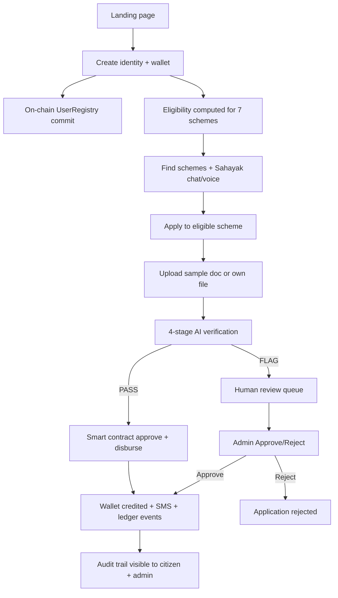

# WelfareChain — Everything Built Till Now

**Last updated:** June 2026  
**Scope:** ICSSR research prototype · Uttar Pradesh · **simulation only** · synthetic data · no real Aadhaar or beneficiary data

This document is the single reference for what the project does today, how every part fits together, what an end user does in the app, and what a teammate must run after cloning the repo so **all features work intact**.

---

## Table of contents

1. [What WelfareChain is](#1-what-welfarechain-is)
2. [Architecture at a glance](#2-architecture-at-a-glance)
3. [Every feature & component](#3-every-feature--component)
4. [End-to-end workflow](#4-end-to-end-workflow)
5. [What a citizen user does (step by step)](#5-what-a-citizen-user-does-step-by-step)
6. [What an administrator does](#6-what-an-administrator-does)
7. [How the backend works](#7-how-the-backend-works)
8. [How the blockchain layer works](#8-how-the-blockchain-layer-works)
9. [How AI verification works](#9-how-ai-verification-works)
10. [How chat & voice agents work](#10-how-chat--voice-agents-work)
11. [Synthetic document dataset](#11-synthetic-document-dataset)
12. [API reference (quick)](#12-api-reference-quick)
13. [Teammate setup — clone to fully working app](#13-teammate-setup--clone-to-fully-working-app)
14. [Optional configuration](#14-optional-configuration)
15. [Troubleshooting](#15-troubleshooting)
16. [What is NOT built yet (Phase 1+)](#16-what-is-not-built-yet-phase-1)

---

## 1. What WelfareChain is

WelfareChain is a **simulated Direct Benefit Transfer (DBT) platform** for Uttar Pradesh. It demonstrates one unified portal where a citizen can:

- Create a digital identity and wallet  
- Discover welfare schemes they may qualify for  
- Apply with supporting documents  
- Pass (or fail) a **4-stage AI verification pipeline**  
- Receive simulated payout to a wallet with SMS notification  
- Leave an **immutable audit trail** on a local blockchain (or simulated ledger)

Administrators see analytics, fraud alerts, human-review queues, a transparency ledger, and a mini block explorer.

Everything uses **free/open-source tools** and **gracefully degrades** when optional pieces are missing (no LLM key → rule-based chatbot; no Hardhat → simulation mode; no Tesseract → label-assisted OCR).

---

## 2. Architecture at a glance

```
┌─────────────────────────────────────────────────────────────────┐
│  Browser  http://localhost:5173  (React + Vite)                   │
│  Landing · Citizen flow · Admin · Voice · Chat · A11y bar       │
└────────────────────────────┬────────────────────────────────────┘
                             │ /api/*  /samples/*  (Vite proxy)
┌────────────────────────────▼────────────────────────────────────┐
│  Backend  http://127.0.0.1:8000  (FastAPI)                        │
│  Users · Applications · Verification · Chatbot · Admin · Chain API│
│  SQLite (default) or Supabase Postgres                          │
└────────────┬───────────────────────────────┬────────────────────┘
             │ web3.py                        │ static files
┌────────────▼────────────┐    ┌──────────────▼────────────────────┐
│  Hardhat local EVM      │    │  data/documents/ (44 synthetic JPGs)│
│  :8545                  │    │  labels.json · gov_records.json     │
│  4 Solidity contracts   │    └─────────────────────────────────────┘
└─────────────────────────┘
```

| Layer | Tech | Folder |
|-------|------|--------|
| Blockchain | Solidity 0.8.24 · Hardhat · OpenZeppelin | `chain/` |
| Backend | FastAPI · SQLAlchemy · PIL/numpy · web3.py | `backend/` |
| Frontend | React 18 · Vite · lucide-react · Hindi-first i18n | `frontend/` |
| Synthetic data | 44 labelled mock documents (28 valid, 16 tampered) | `data/documents/` |
| Design docs | SRS + System Design | `docs/` |

---

## 3. Every feature & component

### 3.1 Frontend (`frontend/src/`)

| File / folder | Role |
|---------------|------|
| **`App.jsx`** | Root shell: role toggle (Citizen / Admin), landing toggle, chain health polling, `ChatProvider`, voice FAB, toast, accessibility integration |
| **`main.jsx`** | React entry point |
| **`api.js`** | Thin fetch client for all backend endpoints |
| **`i18n.js`** | 5 locales: **Hindi, English, Bhojpuri, Awadhi, Urdu** — 200+ UI strings, currency formatter, voice greetings |
| **`documents.js`** | 6 document type definitions, scheme mapping, icons |
| **`styles.css`** | Full v2 design system: hero, landing, citizen flow, admin, voice panel, block explorer, modals, a11y |

#### Components

| Component | What it does |
|-----------|--------------|
| **`Logo.jsx`** | SVG shield + marigold brand mark |
| **`Landing.jsx`** | Marketing hero, problem/solution cards, stats (7 schemes, 6 doc types, 5 languages), embedded document guide, “how it works” steps, feature grid, CTA to launch simulation |
| **`AccessibilityBar.jsx`** | Sticky toolbar: language picker, large text, high contrast, read-aloud (TTS), open voice assistant |
| **`CitizenFlow.jsx`** | Full 5-step citizen journey: Identity → Find schemes → Apply → Verify → Done. Includes preset profiles, wallet banner, scheme cards with eligibility badges, required-doc chips, document picker with filters (all/valid/tampered), verification animation, confetti on success, blockchain audit trail on done screen |
| **`Chatbot.jsx`** | **Sahayak** text chat: shared memory, mic input, TTS on replies, provider badge (Gemini/Groq/FAQ/Offline), quick FAQ buttons, scheme citation chips that start apply flow |
| **`VoiceAgent.jsx`** | **Swar Sahayak** floating voice panel: STT/TTS, quick voice chips, step-aware hints, navigation intents (identity/schemes/docs/admin), auto-speak toggle, wave animation while listening |
| **`DocumentGuide.jsx`** | Interactive tabbed catalogue of all 6 certifiable document types with valid/tampered counts and field explanations |
| **`ApplicationHistory.jsx`** | Lists past applications for logged-in citizen (scheme, status, amount, confidence) |
| **`Admin.jsx`** | Dashboard tiles, district bar chart, fraud alerts with Approve/Reject, clickable transparency ledger, legacy DBT comparison table |
| **`BlockExplorer.jsx`** | Mini explorer: chain mode, block #, gas, deployed contracts (copy address), recent blocks, on-chain events |
| **`TxModal.jsx`** | Transaction detail modal (block, status, from/to, gas, log count) |

#### Hooks & context

| File | Role |
|------|------|
| **`hooks/useSpeech.js`** | Web Speech API wrapper: STT + TTS, locale → BCP-47 mapping (bho/awa fall back to `hi-IN`) |
| **`context/ChatContext.jsx`** | Shared conversation memory between Sahayak chatbot and Swar voice agent; `ask`, `reset`, `addBot`, `addUser` |

---

### 3.2 Backend (`backend/app/`)

| Module | Role |
|--------|------|
| **`main.py`** | FastAPI app: all REST routes, CORS, static `/samples` mount, ledger helpers, SMS log |
| **`db.py`** | SQLAlchemy models: User, Wallet, Application, Document, Verification, LedgerEvent, Alert, SmsLog, GovRecord |
| **`schemes.py`** | 7 UP schemes + eligibility engine (illustrative rules) — **DataSource seam** for real public data later |
| **`verification.py`** | 4-stage AI pipeline: OCR → layout → ELA tamper forensics → gov-records cross-check |
| **`chatbot.py`** | Sahayak: Gemini → Groq → FAQ grounding → regional rule-based fallback; conversation history; scheme citations |
| **`blockchain.py`** | ChainBridge: connects to Hardhat via `chain_artifacts.json`; live txs or simulated hashes |
| **`chain_api.py`** | Read-only chain introspection: info, blocks, tx lookup, controller events |

#### Scripts

| Script | Role |
|--------|------|
| **`scripts/generate_documents.py`** | Generates 44 synthetic JPGs + `labels.json` + `gov_records.json` |
| **`seed.py`** | Loads gov records into DB + optional demo dashboard seed data |

---

### 3.3 Blockchain (`chain/`)

| Contract | Purpose |
|----------|---------|
| **`UserRegistry.sol`** | Hashed identity commitments (privacy-by-design); wallet registration |
| **`SchemeRegistry.sol`** | On-chain catalogue of 7 UP schemes with amounts and rule hashes |
| **`WelfareToken.sol`** | ERC-20-style welfare token (mint on approval, burn on fiat conversion) |
| **`DisbursementController.sol`** | Orchestrates record → verify → approve → disburse lifecycle; emits events |

| Script | Purpose |
|--------|---------|
| **`scripts/deploy.js`** | Deploys all contracts, seeds schemes, writes `backend/chain_artifacts.json` |
| **`test/welfarechain.test.js`** | Contract test suite (5 tests) |

---

### 3.4 Data (`data/documents/`)

- **44 JPG files** across 6 types (not committed images may need regeneration — see setup)  
- **`labels.json`** — per-file metadata: doc_type, tampered flag, DOC-ID, income, hints  
- **`gov_records.json`** — simulated government cross-check database  

---

## 4. End-to-end workflow



**Chain modes**

- **Live:** Hardhat node + deploy running → header shows “Blockchain: live”, block #, ledger rows tagged `on-chain`, real tx hashes in explorer  
- **Simulated:** Chain offline → same UX, simulated tx hashes, tag `simulated` — full demo still works  

**Chat/voice modes**

- **Gemini** (if `GEMINI_API_KEY`) → richest answers  
- **Groq** (if no Gemini but `GROQ_API_KEY`)  
- **FAQ + rules** (no keys) → still helpful, grounded in scheme catalogue  

---

## 5. What a citizen user does (step by step)

### Step 0 — Landing (optional)

1. Open http://localhost:5173  
2. Read hero, problem/solution, document catalogue, 3-step overview  
3. Click **“सिमुलेशन शुरू करें” / Launch simulation**

### Step 1 — Identity (`s_id`)

1. Switch role stays on **नागरिक / Citizen** (top right)  
2. Fill form OR click a **preset profile** (e.g. widow farmer Bahraich, senior citizen Lucknow, person with disability Varanasi)  
3. Fields: name, mock Aadhaar, age, gender, income, occupation, district (14 UP districts), rural/urban, widow/disabled/girl-child/house-type flags, assisted mode  
4. Click **Create wallet** → backend registers user, creates wallet, writes identity commitment on-chain (or sim), returns eligibility list  
5. Wallet address and eligible scheme count appear in banner  

**Accessibility:** Use top bar to change language (5 options), enlarge text, high contrast, read page aloud, or open **Swar Sahayak** voice assistant (mic FAB bottom-right).

### Step 2 — Find schemes (`s_find`)

1. See all **7 schemes** with green (eligible) or red (not eligible) badges  
2. Each card shows amount, description, **required document chips**, and eligibility reasons if not eligible  
3. Use **Sahayak chatbot** (right column):
   - Type or use mic: *“मुझे कौन सी योजनाएँ मिल सकती हैं?”*  
   - Quick buttons: schemes, how to apply, blockchain, documents  
   - Click **scheme citation chips** to jump into apply (if eligible)  
4. **Application history** appears below after first application  
5. **Document guide** (compact) explains all 6 certifiable types  
6. Click **Apply** on a green scheme  

**Voice:** Say *“योजनाएँ”* → navigates here; *“मदद”* → step-specific hint.

### Step 3 — Apply / upload (`s_apply`)

1. See scheme name, amount, required docs  
2. **Filter samples:** all / valid only / tampered (demo)  
3. **Filter by document type:** aadhaar, income, caste, residence, disability, ration  
4. Click thumbnail to preview; **Use this sample** or **Upload your own file**  
5. Click **Run verification**  

**Demo tip:** Valid doc → payout. Tampered doc (red tag **बदला ⚠**) → flagged for human review, never auto-rejected.

### Step 4 — Verify (`s_verify`)

Watch 4 animated stages:

1. OCR text extraction  
2. Layout understanding  
3. Tamper / forgery (ELA forensics)  
4. Government records cross-check  

Each stage is logged to blockchain (or simulation).

### Step 5 — Done (`s_done`)

- **Disbursed:** confetti, amount credited, wallet balance, SMS toast, blockchain audit trail with tx hashes  
- **Flagged:** explanation of what AI found, human review message, audit trail  
- **Apply for another scheme** or **View admin dashboard**

---

## 6. What an administrator does

1. Click **प्रशासक / Administrator** in header  
2. **Block explorer** — chain mode, block number, contracts, recent blocks, events (click event → tx modal)  
3. **Metric tiles** — total disbursed, application count, approval rate, fraud flags  
4. **District analytics** — bar chart of disbursements by UP district  
5. **Fraud alerts** — flagged applications; **Approve** (disburse after review) or **Reject**  
6. **Transparency ledger** — every action with meta; **click row** for full transaction details  
7. **Comparison matrix** — WelfareChain vs legacy DBT (transparency, speed, fragmentation, fraud handling, steps)

---

## 7. How the backend works

### Database tables (prefix `wc_`)

| Table | Stores |
|-------|--------|
| Users | Profile + id_commitment + assisted flag |
| Wallets | Address + fiat_balance |
| Applications | scheme_key, amount, status, confidence, district |
| Documents | Uploaded path, sample_id, doc_type |
| Verifications | decision, confidence, checks JSON, reasons JSON |
| LedgerEvents | action, meta, tx_hash, block, onchain flag |
| Alerts | Unresolved fraud/review flags |
| SmsLogs | Simulated SMS text |
| GovRecords | Cross-check source of truth for DOC-IDs |

### Application status lifecycle

`Draft` → `Verifying` → `Disbursed` **or** `Flagged` → (human review) → `Disbursed` **or** `Rejected`

### Key design rules

- **Never auto-reject** on AI failure — always `Flagged` + Alert  
- Every chain operation mirrored to `wc_ledger` for admin UI  
- `/samples` serves synthetic JPGs from `data/documents/`  
- User uploads go to `backend/uploads/`

---

## 8. How the blockchain layer works

1. **`npx hardhat node`** — local EVM at `http://127.0.0.1:8545`  
2. **`npm run deploy`** — deploys 4 contracts, seeds 7 schemes, writes **`backend/chain_artifacts.json`**  
3. Backend **`ChainBridge`** reads artifacts on startup  
4. On user registration → `UserRegistry` commitment + new wallet address  
5. On verification → `recordVerification` event  
6. On pass → `approve` + token mint + burn (fiat conversion) + `Disbursed` event  
7. On human review → `resolveReview` then optional disburse  

**Frontend chain features**

- Header badge: live vs simulated + live block #  
- `GET /api/chain/info|blocks|tx/{hash}|events`  
- Admin BlockExplorer + TxModal  
- Citizen done-screen audit trail  

---

## 9. How AI verification works

| Stage | Method | Pass / flag logic |
|-------|--------|-------------------|
| 1. OCR | pytesseract (optional) + label fallback | Text/fields extracted; DOC-ID parsed |
| 2. Layout | Image dimension / structure checks | Basic sanity |
| 3. Tamper | Error Level Analysis (PIL + numpy blocks) + metadata | Tampered samples score high outlier ratio |
| 4. Cross-check | DOC-ID → GovRecords DB | Income/doc_type match profile; invalid UID flags |

**Output:** `PASS` or `FLAG`, confidence 0–1, bilingual reasons array, per-check breakdown.

**Ethical rule:** `FLAG` routes to human review — **no automatic rejection**.

---

## 10. How chat & voice agents work

### Sahayak (text chatbot)

- Backend: `POST /api/chat` with `{ user_id, message, locale, history[] }`  
- Provider chain: **Gemini 1.5 Flash** → **Groq** → **FAQ keyword match** → **rule-based regional fallback** (bho/awa/ur)  
- Returns: `{ reply, suggested[], provider, citations[], grounded }`  
- Citations link eligible schemes with amounts — frontend starts apply on chip click  
- **Shared memory** via `ChatContext` (last 8 turns sent to LLM)

### Swar Sahayak (voice agent)

- Same `ChatContext` — voice and text share one conversation  
- **Local intents** (no API call): help, navigate steps, open admin, blockchain explainer, tamper demo hint  
- Otherwise calls same `ask()` as chatbot  
- **Auto-speak** toggle for TTS replies  
- **5 languages** in UI; STT uses `hi-IN` fallback for Bhojpuri/Awadhi (browser limitation)

---

## 11. Synthetic document dataset

Generated by `python scripts/generate_documents.py`:

| Type | Valid | Tampered | Total |
|------|-------|----------|-------|
| Income | 12 | 6 | 18 |
| Aadhaar | 4 | 2 | 6 |
| Caste | 3 | 2 | 5 |
| Residence | 3 | 2 | 5 |
| Disability | 3 | 2 | 5 |
| Ration | 3 | 2 | 5 |
| **Total** | **28** | **16** | **44** |

All images marked **GOVERNMENT OF UTTAR PRADESH (SIMULATED) — SPECIMEN / NOT REAL**.

---

## 12. API reference (quick)

| Method | Path | Purpose |
|--------|------|---------|
| GET | `/api/health` | OK + chain mode + block_number |
| GET | `/api/chain/info` | Chain status, contracts, gas |
| GET | `/api/chain/blocks` | Recent blocks |
| GET | `/api/chain/tx/{hash}` | Transaction details |
| GET | `/api/chain/events` | Controller events |
| GET | `/api/schemes` | 7-scheme catalogue |
| GET | `/api/documents/samples` | Sample list with tampered flags |
| POST | `/api/users` | Create citizen + wallet |
| GET | `/api/users/{id}` | Profile + wallet + eligibility + SMS |
| GET | `/api/users/{id}/applications` | Application history |
| POST | `/api/chat` | Sahayak chatbot |
| POST | `/api/applications` | Start application |
| POST | `/api/applications/{id}/documents` | Upload sample or file |
| POST | `/api/applications/{id}/verify` | Run AI + chain disburse/flag |
| GET | `/api/applications/{id}` | Status + verification + audit trail |
| GET | `/api/admin/metrics` | Dashboard aggregates |
| GET | `/api/admin/ledger` | Transparency ledger |
| POST | `/api/admin/review/{id}` | Human approve/reject |

Interactive docs: http://127.0.0.1:8000/docs

---

## 13. Teammate setup — clone to fully working app

Follow this **exact order** after cloning. You need **4 terminals** for the full experience (live blockchain + all AI features).

### Prerequisites (one-time)

| Tool | Version | Check |
|------|---------|-------|
| Node.js | 18+ | `node -v` |
| Python | 3.10+ | `python3 --version` |
| Git | any | `git --version` |

**Optional but recommended**

| Tool | Why |
|------|-----|
| Tesseract OCR | Real OCR on custom uploads (`brew install tesseract` on macOS) |
| Gemini or Groq API key | Smarter chatbot (free tiers — see §14) |

### Step A — Clone

```bash
git clone https://github.com/vansh007/WelfareChain.git
cd WelfareChain
```

### Step B — Terminal 1: Blockchain node

```bash
cd chain
npm install
npx hardhat node
```

Leave running. Chain at **http://127.0.0.1:8545**.

### Step C — Terminal 2: Deploy contracts

```bash
cd chain
npm run deploy
```

**Must re-run after every Hardhat node restart** (chain state resets).  
Creates **`backend/chain_artifacts.json`** — required for live chain mode.

Optional: `npm test` (5 contract tests).

### Step D — Terminal 3: Backend

```bash
cd backend
python3 -m venv .venv          # recommended
source .venv/bin/activate      # Windows: .venv\Scripts\activate
pip install -r requirements.txt

# REQUIRED on fresh clone — generates 44 documents + JSON metadata
python scripts/generate_documents.py
python seed.py

# Optional: copy and fill API keys
cp .env.example .env

uvicorn app.main:app --reload --port 8000
```

Verify: http://127.0.0.1:8000/api/health → `"chain": "live"` (if Terminals 1–2 up).

### Step E — Terminal 4: Frontend

```bash
cd frontend
npm install
npm run dev
```

Open **http://localhost:5173**

### Step F — Smoke test (2 minutes)

1. Header shows **Blockchain: live** and block #  
2. Launch simulation → create wallet with default preset  
3. Ask chatbot a scheme question → get reply (provider badge visible)  
4. Apply Old Age Pension with a **valid** income sample → Disbursed + confetti  
5. Switch to Admin → see block explorer, ledger, metrics  
6. Click a ledger tx hash → modal opens  
7. Open voice FAB → speak or tap a chip → hear/read reply  

### What gets created locally (not in git)

| Path | Created by |
|------|------------|
| `data/documents/*.jpg` | `generate_documents.py` |
| `data/documents/labels.json` | `generate_documents.py` |
| `data/documents/gov_records.json` | `generate_documents.py` |
| `backend/chain_artifacts.json` | `npm run deploy` |
| `backend/welfarechain.db` | first backend run (SQLite) |
| `backend/uploads/` | user file uploads |
| `node_modules/` | npm install (both chain + frontend) |

> **Important:** If sample documents are missing in the Apply step, run `python scripts/generate_documents.py` again from `backend/`.

### Minimum setup (no blockchain)

If you only want UI + API quickly:

```bash
# Terminal 1
cd backend && pip install -r requirements.txt
python scripts/generate_documents.py && python seed.py
uvicorn app.main:app --reload --port 8000

# Terminal 2
cd frontend && npm install && npm run dev
```

Header will show **Blockchain: simulated** — everything else still works.

---

## 14. Optional configuration

Copy `backend/.env.example` → `backend/.env`:

| Variable | Effect |
|----------|--------|
| `DATABASE_URL` | Supabase/Postgres URI; empty = local SQLite |
| `GEMINI_API_KEY` | Chatbot via Google AI Studio (free) |
| `GROQ_API_KEY` | Fallback LLM if no Gemini |
| `CHAIN_RPC` | Default `http://127.0.0.1:8545` |

Restart backend after editing `.env`.

---

## 15. Troubleshooting

| Symptom | Fix |
|---------|-----|
| “Blockchain: simulated” | Start `npx hardhat node`, then `npm run deploy` |
| No documents in Apply step | `python scripts/generate_documents.py` in `backend/` |
| Chatbot feels templated | Add `GEMINI_API_KEY` in `.env` |
| `pip install` fails on psycopg2 | Only needed for Postgres; remove line if using SQLite only |
| Port 8000 in use | `uvicorn app.main:app --port 8001` + update `frontend/vite.config.js` proxy |
| Voice not working | Use Chrome; grant mic permission |
| Deploy fails “nonce” / connection | Restart hardhat node, redeploy |
| Stale tx in explorer | Hardhat was reset — old hashes won’t resolve (expected) |

---

## 16. What is NOT built yet (Phase 1+)

These were planned but **not implemented** as of this document:

- Formal **eval harness** with precision/recall metrics on expanded dataset  
- Dataset expansion to 150–300 labelled documents  
- **Bias audit** across districts/demographics  
- Formal **DataSource seam** wiring to real public scheme APIs  
- Production auth, real Aadhaar integration, or live government chain  
- README auto-sync for every latest UI string (use this file + `docs/` for now)

---

## Quick reference — 7 schemes

| Key | Scheme | Amount (₹) | Typical docs |
|-----|--------|------------|--------------|
| oap | Old Age Pension | 12,000 | aadhaar, income |
| wid | Widow Pension | 6,000 | aadhaar, income |
| div | Divyangjan Pension | 12,000 | aadhaar, income |
| kny | Kanya Sumangala | 25,000 | aadhaar, income |
| kis | PM-KISAN | 6,000 | aadhaar |
| nfsa | Food Subsidy (NFSA) | 6,000 | aadhaar, income |
| pmay | Housing (PMAY-G) | 1,20,000 | aadhaar, income |

Eligibility rules are **illustrative** — see `backend/app/schemes.py`.

---

*WelfareChain · simulation prototype · synthetic data only · Uttar Pradesh scope · ICSSR research*
